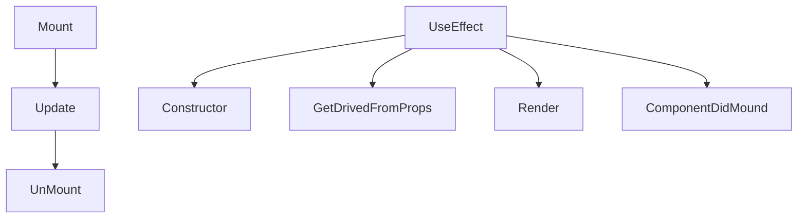
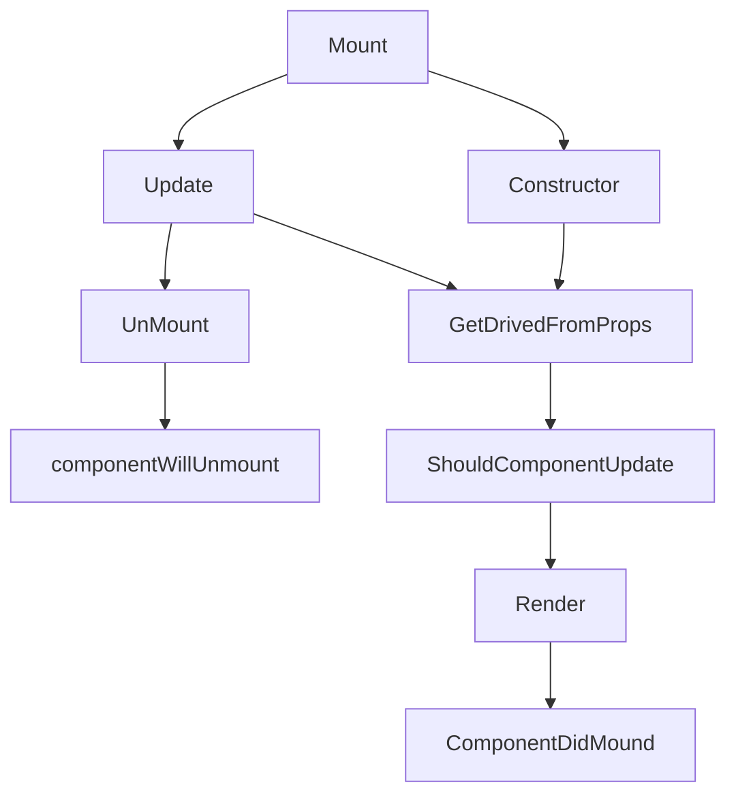

```js
//executa toda vez a renderizacao quando click/refresh
import React, {useState} from 'react';
import {View, Text, Button} from 'react-native';

const Componente = () => {
  const [numero, setNumero] = useState(0)
  console.log("render() - executado")
  return (
    <View style={{flex:1, 
      justifyContent: "center", 
      alignItems: "center"}}>
      <Text>Meu componente</Text>
      <Text>Numero: {numero}</Text>
      <Button title="Incrementar" onPress={()=>{
        setNumero(numero + 1);
      }}/>
    </View>
  );
}


export default () => 
<View style={{flex: 1, backgroundColor: "#FFFFDD"}}>
  <Componente/>
</View>
```

```js
//useEfect
import React, {useState, useEffect} from 'react';
import {View, Text, Button} from 'react-native';

const Componente = () => {
  const [numero1, setNumero1] = useState(0)
  const [numero2, setNumero2] = useState(0)

  // useEffect( <função>, <lista das variaveis>)

  useEffect(()=> { 
    console.log("useEffect() - executado")
  }, [numero2])

  console.log("componente() - executado")
  return (
    <View style={{flex:1, 
      justifyContent: "center", 
      alignItems: "center"}}>
      <Text>Meu componente</Text>
      <Text>Numero 1: {numero1}</Text>
      <Button title="Incrementar" onPress={()=>{
        setNumero1(numero1 + 1);
      }}/>
      <Text>Numero 2: {numero2}</Text>
      <Button title="Incrementar" onPress={()=>{
        setNumero2(numero2 + 1);
      }}/>
    </View>
  );
}


export default () => 
<View style={{flex: 1, backgroundColor: "#FFFFDD"}}>
  <Componente/>
</View>
```

